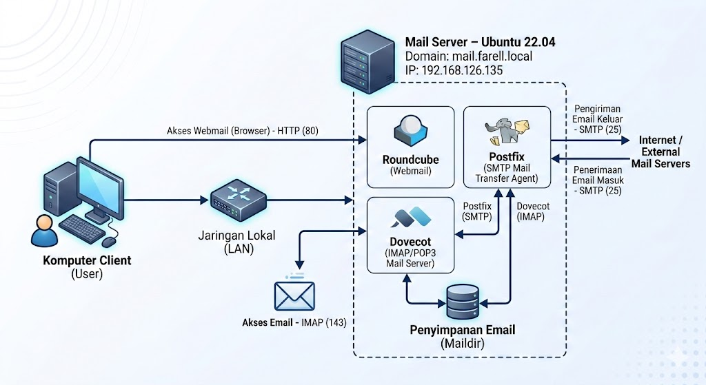
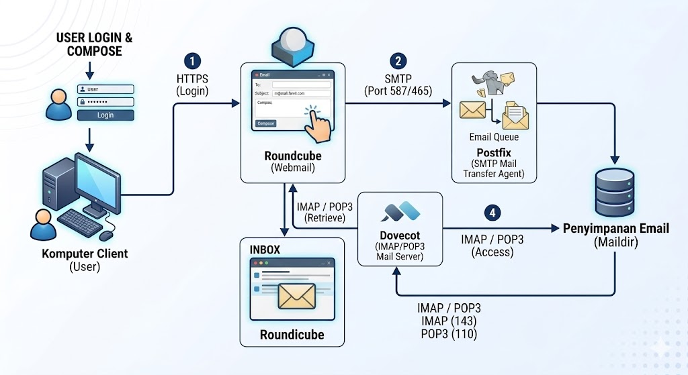

# Mail Server Ubuntu 22.04 (Postfix + Dovecot + Roundcube)

This repository documents how to build a simple mail server using **Ubuntu Server 22.04** inside a **VMware virtual machine**.

The purpose of this project is to understand the architecture and workflow of a mail server, including how email is sent, stored, and retrieved using common open-source mail server components.

This project uses a **local domain environment** for testing and learning purposes.

Domain used in this setup:

mail.farell.local

---

# Mail Server Stack

The mail server is built using the following components:

### Postfix
Postfix acts as the **SMTP (Simple Mail Transfer Protocol) server** responsible for sending and routing emails.

### Dovecot
Dovecot provides **IMAP and POP3 services** which allow users to retrieve and read emails from the mail server.

### Roundcube
Roundcube is a **web-based email client** that allows users to access their mailbox through a browser.

### Apache
Apache is used as the **web server** to host the Roundcube webmail interface.

### PHP
PHP is required to run Roundcube.

### MariaDB
MariaDB is used as the **database backend** for Roundcube.

---

# Mail Server Ports

The following ports are used in this project.

| Service | Protocol | Port |
|------|------|------|
| SMTP | Mail sending | 25 |
| IMAP | Mail retrieval | 143 |
| POP3 | Mail retrieval | 110 |
| HTTP | Webmail access | 80 |

---

# Network Topology

Below is the topology used in this mail server lab environment.



Explanation:

Client devices access the mail server through a web browser.  
Users log in to Roundcube which communicates with Postfix and Dovecot to send and receive emails.

---

# Mail Flow Process

The following diagram shows how email flows inside the system.



Email flow overview:

1. User logs into Roundcube through the browser.
2. When sending an email, Roundcube sends the message to Postfix using SMTP.
3. Postfix processes the email and stores it in the recipient’s Maildir.
4. Dovecot provides access to the stored email via IMAP or POP3.
5. Roundcube retrieves the email from Dovecot and displays it in the inbox.

---

# Email Accounts

In this setup, **Linux system users are used as mail accounts**.

Example:

user1@farell.local  
user2@farell.local

Each Linux user automatically has a mailbox stored in their home directory.

---

# Access Webmail

Open a browser and go to:
```bash
http://SERVER-IP/roundcube
```

Login using the Linux user credentials.

---

# Installation Guide

The full installation steps and troubleshooting guide are available here: ```docs/installation-steps.md```

---

# Project Purpose

This project is intended for:

- Learning Linux server administration
- Understanding mail server architecture
- Practicing Postfix and Dovecot configuration
- Understanding how webmail systems work

---

## © 2026 Farell Kurniawan

Copyright © 2026 Farell Kurniawan. All rights reserved.  
Distribution and use of this code is permitted under the terms of the **MIT** license.